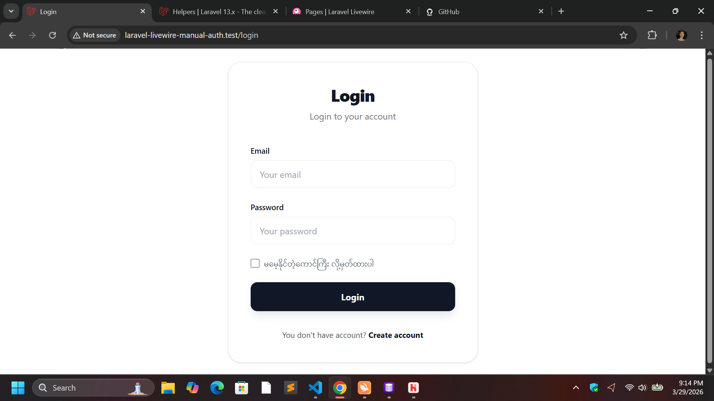
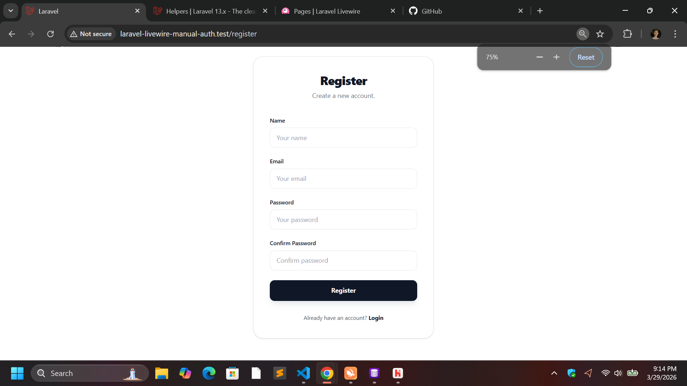
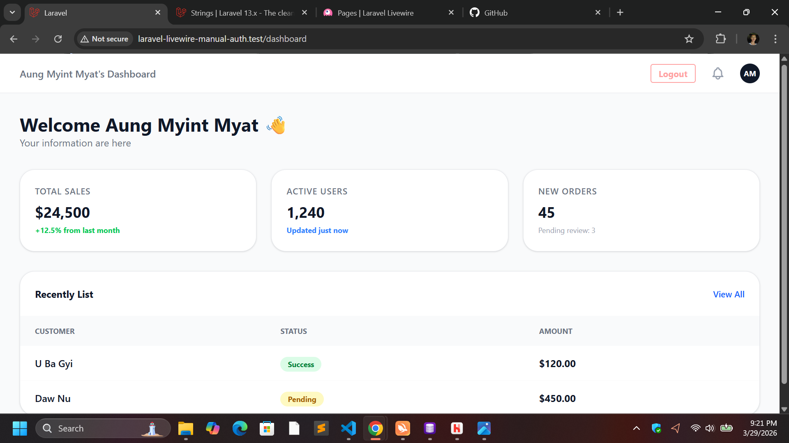
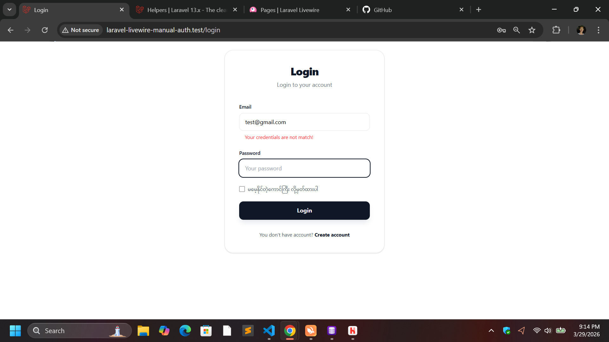
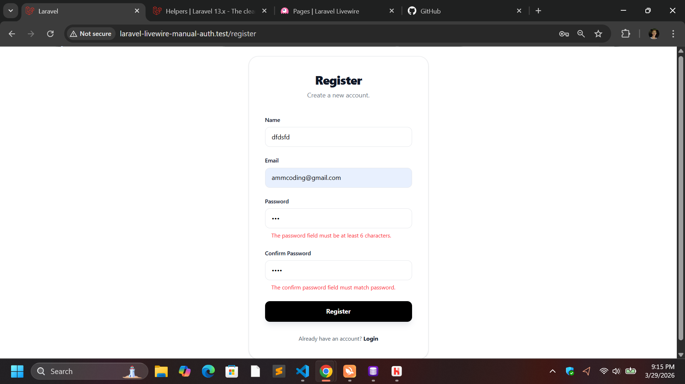

## 🚀 Laravel-Livewire Manual Auth

A clean, lightweight, and professional manual authentication system built with Laravel 13 and Livewire 4. This project is for learning authentication process and in order to use somewhere in the future projects.

### ✨ Features

- Full-Page Components: Seamlessly integrated page components using the default Laravel application layout.

- Secure Password Hashing: Robust security using the Bcrypt hashing driver to encrypt user credentials during registration.

- Tailwind CSS UI: Styled with a modern, custom aesthetic. (Note: Current UI is optimized for desktop and is non-responsive).

- "Remember Me" Functionality: Built-in support for persistent user sessions using secure cookies.

- Developer-Centric Code: Prioritizes Helper Functions over Facades where appropriate for a cleaner, more modern syntax.

- Reusable UI Components: Includes a modular <x-input /> component to maintain DRY (Don't Repeat Yourself) principles.

### 🛠️ Tech Stack

- Laravel 13.x -> Backend Framework
- Livewire 3.x -> Frontend Reactivity
- Tailwind CSS -> Styling & Layout
- SQLite -> Database

### ⚙️ Installation & Setup

Follow these steps to get the project running on your local machine:

1. Clone the Repository

```bash
git clone https://github.com/aung-myint-myat-dev/laravel-livewire-manual-auth.git
cd laravel-livewire-manual-auth
```

2. Install Dependencies

```bash
composer install
npm install & npm run build
```

3. Environment Configuration
   Copy the example environment file and generate the application key:

```bash
cp .env.example .env
php artisan key:generate
```

4. Database Setup (SQLite)
   Ensure your .env is set to DB_CONNECTION=sqlite.

```Bash
touch database/database.sqlite
php artisan migrate
```

5. Launch the Server

```Bash
php artisan serve
```

### 🔒 Security Specifications

- Encryption: Uses Bcrypt (Industry Standard) for all password hashing.

- Session Protection: Implements session()->invalidate() and regenerateToken() upon logout to prevent Session Hijacking and Fixation attacks.

- Authentication Guard: Utilizes the standard web guard with manual Auth::attempt() logic for granular control.

### 📂 Project Structure

```
views
│   dashboard.blade.php
│   welcome.blade.php
│   
├───components
│       input.blade.php
│       
├───layouts
│       app.blade.php
│
└───pages
    └───auth
            ⚡login.blade.php
            ⚡register.blade.php
```

### 📸 Screenshots

<table style="width: 100%;">
  <tr>
    <td style="width: 50%; text-align: center;">
      <strong>🔐 Login Page</strong><br>
      
    </td>
    <td style="width: 50%; text-align: center;">
      <strong>📝 Register Page</strong><br>
      
    </td>
  </tr>
  <tr>
    <td style="width: 50%; text-align: center; padding-top: 20px;">
      <strong>📊 Dashboard</strong><br>
      
    </td>
    <td style="width: 50%; text-align: center; padding-top: 20px;">
      <strong>❌ Login Error State</strong><br>
      
    </td>
    <td style="width: 50%; text-align: center; padding-top: 20px;">
      <strong>❌ Register Error State</strong><br>
      
    </td>
  </tr>
</table>

### 📝 License

This project is open-source software licensed under the MIT license.